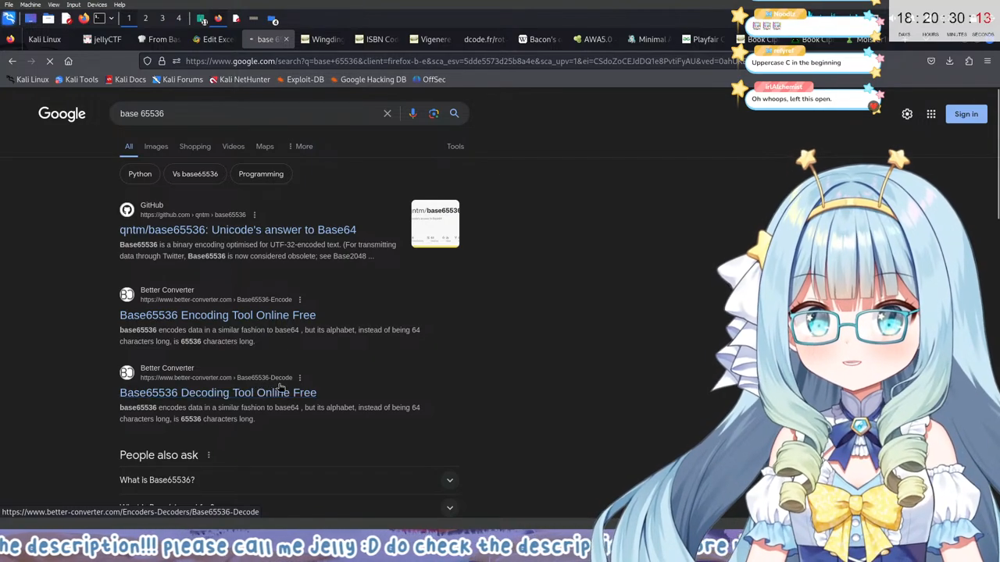
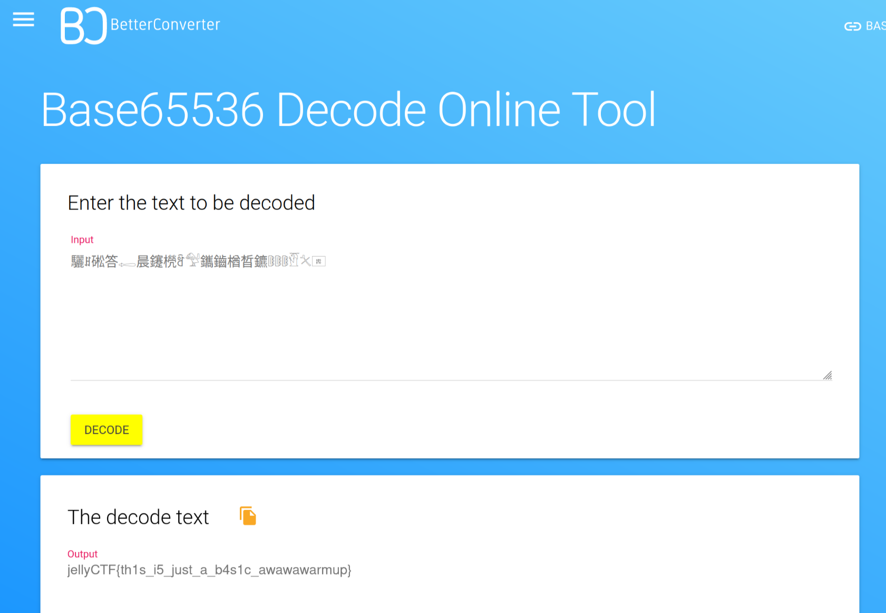
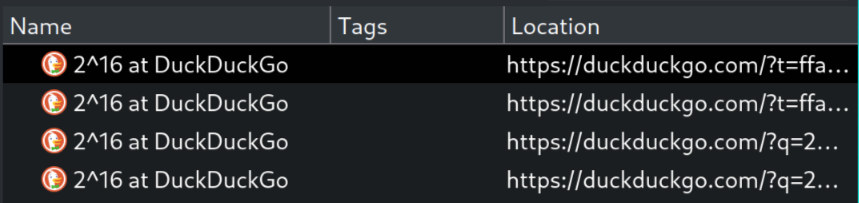
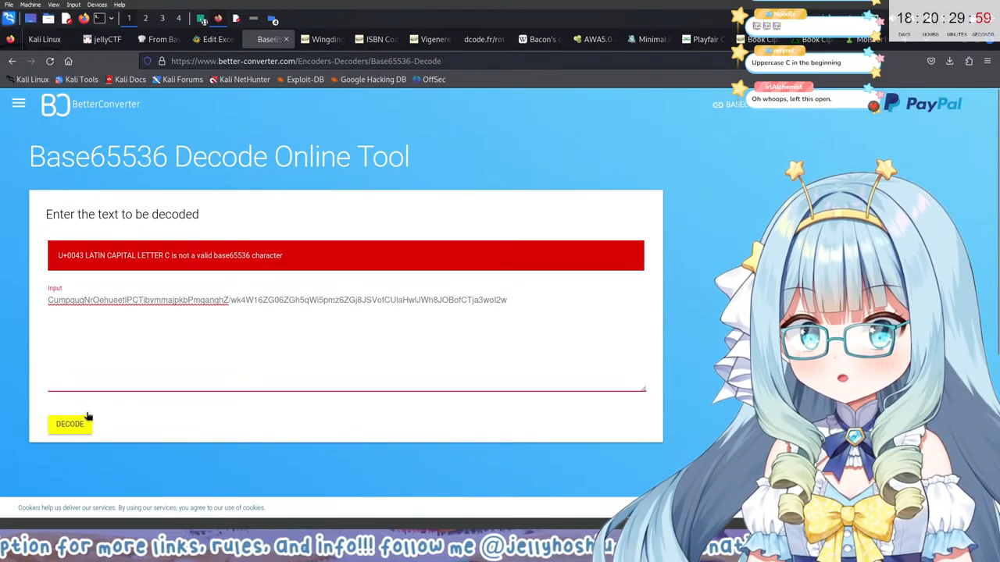
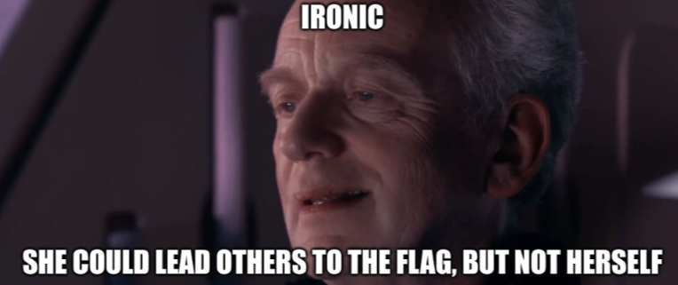

# [crypto] you're_based

Points: 935

Difficulty: easy

Here's a basic encoding challenge to start with: `VGhhdCB3YXMganVzdCBhIHdhcm0gdXAuIEhlcmUgaXMgdGhlIGFjdHVhbCBmbGFnLCB0aG91Z2ggeW91IG1heSBuZWVkIGEgYmFzZSB0aGF0J3MgJ0EnIGJpdCBsYXJnZXI6CumpquqNrOehueetlPCTibvmmajpkbPmqanqhZ/wk4W16ZG06ZGh5qWi5pmz6ZGj8JSVofCUlaHwlJWh8JOBofCTja3woI2w`

Author: Sheepiro

<details>
<summary>View Hint</summary>

Stage 1: A common base decoding  
Stage 2: A bigger base is needed... how many bits were in stage 1's base? What's A in hexadecimal?

</details>

<style>
details summary { 
    cursor: pointer;
}
</style>

## First impressions

Off the cuff, the text given appears to be encoded in base64, and surely enough throwing it into a base64 encoder, we get the following:

```bash
$ echo "VGhhdC...3woI2w" | base64 -d
That was just a warm up. Here is the actual flag, though you may need a base that's 'A' bit larger:
驪ꍬ硹答𓉻晨鑳橩ꅟ𓅵鑴鑡楢晳鑣𔕡𔕡𔕡𓁡𓍭𠍰
```

The message text suggesets we use a base that's 'A' bits larger than base64, so let's first consider how many bits base64 uses.

base64's character set has, as its name suggests, 64 characters, which can be encoded as a number from 0-63. If you're familiar with binary, you'll recognize that $64=2^6$ and surely enough, 6 bits is enough to denote the numbers 0-63.

Considering the rest of the sentence, 'A' is commonly recognized as 10 in hexadecimal, so putting that together we should be looking to decode the flag in $6+10=16$ bits! And here's where I ran into my first issues.

## Hitting a wall

It should be noted that by this point in the event, I had already gone through many challenges (completed all of web!), but since starting the event I quickly hit a wall with this challenge.

Unfortunately, I think I just wasn't hitting the right search terms, I found articles on base85 and base92, and after a few days of looking at the problem intermittently I was beginning to think I was going mad over such an easy problem.

Stumped, I spent the night watching [Jelly's CTF VOD](https://www.youtube.com/watch?v=QH8LKkIVHzI) to cool down and gather myself, and when I got to [3:29:21](https://www.youtube.com/watch?v=QH8LKkIVHzI&t=12561) in VOD I jumped from my chair and rushed to my computer.



## Eureka moment

As it turns out, Jelly, although ultimately unsuccessful, was very close to solving this question on stream. Using the hint, she came to $2^{16}=65536$ and searched `base 65536` for an online decoder.

In my searches, I had gone through many tools such as [BaseCracker](https://github.com/skyf0l/BaseCracker) in a desperate attempt at a solution, but I hadn't seen the first search result that Jelly had: [qntm/base65536](https://github.com/qntm/base65536).

```js
import { encode, decode } from 'base65536'

const uint8Array = new Uint8Array([104, 101, 108, 108, 111, 32, 119, 111, 114, 108, 100])

const string = encode(uint8Array)
console.log(string);
// 6 code points, '驨ꍬ啯𒁷ꍲᕤ'

const uint8Array2 = new Uint8Array( decode(string))
console.log(uint8Array2);
// [104, 101, 108, 108, 111, 32, 119, 111, 114, 108, 100]
```

The first usage example on the repo page has some familiar sights, so I copied that example and modified it to use the flag from earlier,

```js
// main.js

import { decode } from 'base65536'

const uint8Array2 = new Uint8Array(decode("驪ꍬ硹答𓉻晨鑳橩ꅟ𓅵鑴鑡楢晳鑣𔕡𔕡𔕡𓁡𓍭𠍰"))
const decoded = new TextDecoder().decode(uint8Array2);

console.log(decoded)
```

```bash
$ node main.js
jellyCTF{th1s_i5_just_a_b4s1c_awawawarmup}
```

Voila! Our flag, `jellyCTF{th1s_i5_just_a_b4s1c_awawawarmup}`. 

## Reflections

In retrospect, passing the encoded text into the online tool that Jelly uses would've also given the answer, so unfortunately this is a case of me making a lot of trouble for myself.



I also wonder exactly what I was searching at the time, because looking at some of my search results I can see I _did_ attempt to use the fact that $2^{16}=65536$, although I was clearly missing a large part of the puzzle.



Despite all that though, I think this is still preferred to Jelly's unfortunate predicament of passing the wrong text into the decoder,



...so close but no banana, have my prequel meme,



## Summary

base64 uses 6 bits, plus 10 (from 'A' in hex) = 16 bits

base2^16 = base65536

base64 -> base65536 -> plain text flag

Final flag: `jellyCTF{th1s_i5_just_a_b4s1c_awawawarmup}`

### Related

I have some more somewhat base65536-related foibles (more general encoding/decoding) with [oshi_mark](../../forensics/oshi_mark/index.md), although this challenge is labelled as `hard` so maybe it's more understandable.
