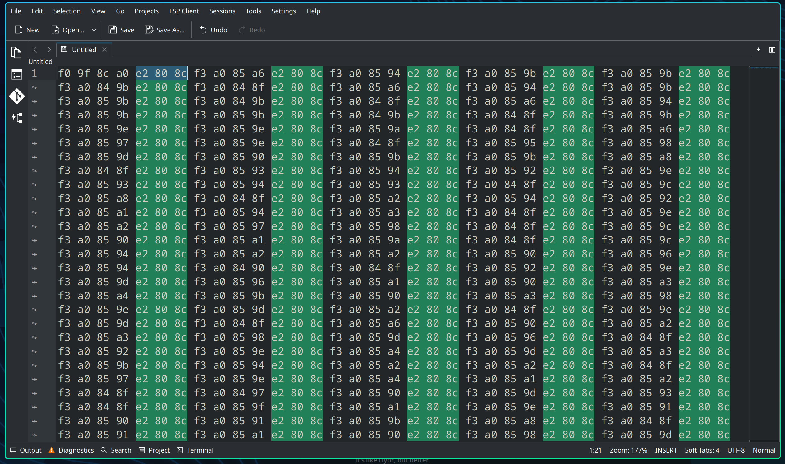
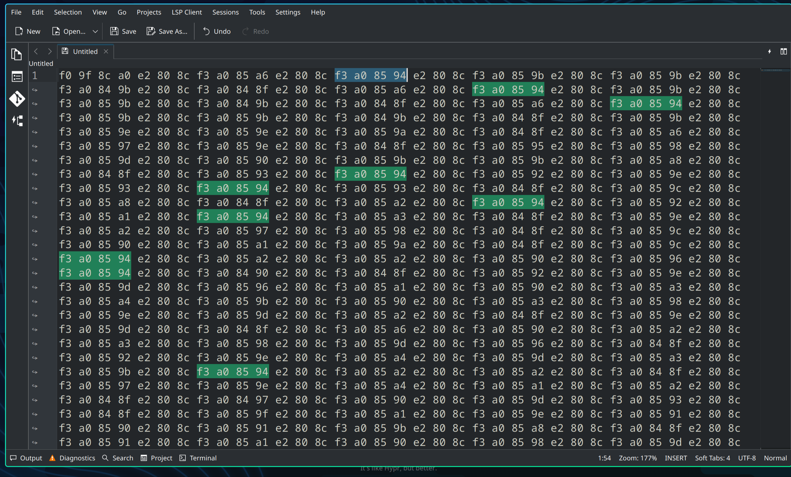
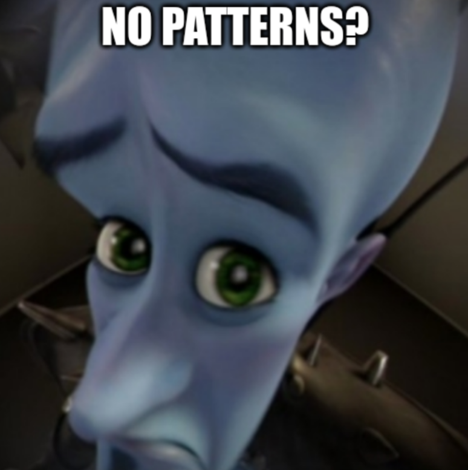
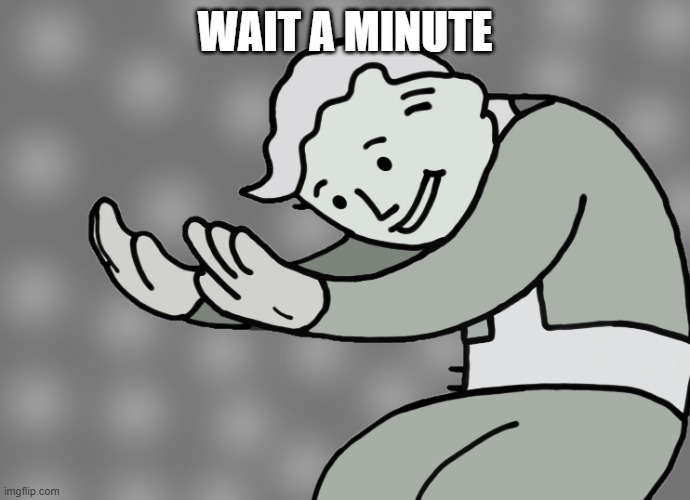
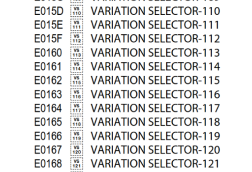
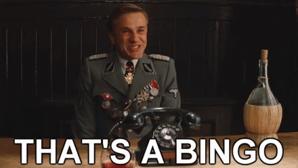

# [forensics] oshi_mark

Points: 951

Difficulty: hard

Author: Meow Mix

Description: 🌠‌󠅦‌󠅔‌󠅛‌󠅛‌󠄛‌󠄏‌󠅦‌󠅔‌󠅛‌󠅛‌󠄛‌󠄏‌󠅦‌󠅔‌󠅛‌󠅛‌󠄛‌󠄏‌󠅛‌󠅞‌󠅞‌󠅚‌󠄏‌󠅦‌󠅗‌󠅞‌󠄏‌󠅕‌󠅘‌󠅝‌󠅐‌󠅛‌󠅛‌󠅨‌󠄏‌󠅓‌󠅔‌󠅒‌󠅞‌󠅓‌󠅔‌󠅓‌󠄏‌󠅜‌󠅨‌󠄏‌󠅢‌󠅔‌󠅒‌󠅡‌󠅔‌󠅣‌󠄏‌󠅞‌󠅢‌󠅗‌󠅘‌󠄏‌󠅜‌󠅐‌󠅡‌󠅚‌󠄏‌󠅜‌󠅔‌󠅢‌󠅢‌󠅐‌󠅖‌󠅔‌󠄐‌󠄏‌󠅒‌󠅞‌󠅝‌󠅖‌󠅡‌󠅐‌󠅣‌󠅤‌󠅛‌󠅐‌󠅣‌󠅘‌󠅞‌󠅝‌󠅢‌󠄏‌󠅞‌󠅝‌󠄏‌󠅦‌󠅐‌󠅢‌󠅣‌󠅘‌󠅝‌󠅖‌󠄏‌󠅒‌󠅞‌󠅤‌󠅝‌󠅣‌󠅛‌󠅔‌󠅢‌󠅢‌󠄏‌󠅗‌󠅞‌󠅤‌󠅡‌󠅢‌󠄏‌󠄗‌󠅐‌󠅝‌󠅓‌󠄏‌󠅟‌󠅡‌󠅞‌󠅑‌󠅐‌󠅑‌󠅛‌󠅨‌󠄏‌󠅑‌󠅡‌󠅐‌󠅘‌󠅝‌󠄏‌󠅒‌󠅔‌󠅛‌󠅛‌󠅢‌󠄘‌󠄏‌󠅕‌󠅘‌󠅖‌󠅤‌󠅡‌󠅘‌󠅝‌󠅖‌󠄏‌󠅞‌󠅤‌󠅣‌󠄏‌󠅣‌󠅗‌󠅐‌󠅣‌󠄏‌󠄑‌󠅐‌󠅦‌󠅐‌󠅦‌󠅐‌󠅦‌󠅐‌󠄑‌󠄏‌󠅜‌󠅔‌󠅐‌󠅝‌󠅢‌󠄏‌󠄑‌󠅘‌󠄏‌󠅛‌󠅞‌󠅥‌󠅔‌󠄏‌󠅨‌󠅞‌󠅤‌󠄐‌󠄑‌󠄏‌󠅜‌󠅐‌󠅨‌󠅑‌󠅔‌󠄏‌󠅨‌󠅞‌󠅤‌󠄖‌󠅥‌󠅔‌󠄏‌󠅕‌󠅘‌󠅝‌󠅐‌󠅛‌󠅛‌󠅨‌󠄏‌󠅕‌󠅞‌󠅤‌󠅝‌󠅓‌󠄏‌󠅐‌󠄏‌󠅤‌󠅢‌󠅔‌󠄏‌󠅕‌󠅞‌󠅡‌󠄏‌󠅐‌󠅛‌󠅛‌󠄏‌󠅣‌󠅗‌󠅐‌󠅣‌󠄏‌󠅝‌󠅔‌󠅡‌󠅓‌󠅨‌󠄏‌󠅚‌󠅝‌󠅞‌󠅦‌󠅛‌󠅔‌󠅓‌󠅖‌󠅔‌󠄏‌󠅨‌󠅞‌󠅤‌󠄖‌󠅥‌󠅔‌󠄏‌󠅐‌󠅒‌󠅒‌󠅤‌󠅜‌󠅤‌󠅛‌󠅐‌󠅣‌󠅔‌󠅓‌󠄏‌󠅞‌󠅥‌󠅔‌󠅡‌󠄏‌󠅣‌󠅗‌󠅔‌󠄏‌󠅨‌󠅔‌󠅐‌󠅡‌󠅢‌󠄝‌󠄏‌󠅐‌󠅝‌󠅓‌󠄏‌󠅛‌󠅔‌󠅣‌󠄖‌󠅢‌󠄏‌󠅑‌󠅔‌󠄏‌󠅗‌󠅞‌󠅝‌󠅔‌󠅢‌󠅣‌󠄛‌󠄏‌󠅨‌󠅞‌󠅤‌󠄏‌󠅟‌󠅡‌󠅞‌󠅑‌󠅐‌󠅑‌󠅛‌󠅨‌󠄏‌󠅒‌󠅞‌󠅤‌󠅛‌󠅓‌󠅝‌󠄖‌󠅣‌󠄏‌󠅔‌󠅥‌󠅔‌󠅝‌󠄏‌󠅕‌󠅘‌󠅖‌󠅤‌󠅡‌󠅔‌󠄏‌󠅞‌󠅤‌󠅣‌󠄏‌󠅣‌󠅗‌󠅔‌󠄏‌󠅜‌󠅔‌󠅢‌󠅢‌󠅐‌󠅖‌󠅔‌󠄏‌󠅦‌󠅘‌󠅣‌󠅗‌󠅞‌󠅤‌󠅣‌󠄏‌󠅡‌󠅔‌󠅛‌󠅨‌󠅘‌󠅝‌󠅖‌󠄏‌󠅞‌󠅝‌󠄏‌󠅐‌󠄏‌󠅢‌󠅘‌󠅛‌󠅛‌󠅨‌󠄏‌󠅤‌󠅝‌󠅘‌󠅒‌󠅞‌󠅓‌󠅔‌󠄏‌󠅓‌󠅔‌󠅒‌󠅞‌󠅓‌󠅘‌󠅝‌󠅖‌󠄏‌󠅢‌󠅘‌󠅣‌󠅔‌󠄏‌󠅨‌󠅞‌󠅤‌󠄏‌󠅕‌󠅞‌󠅤‌󠅝‌󠅓‌󠄏‌󠅤‌󠅢‌󠅘‌󠅝‌󠅖‌󠄏‌󠅗‌󠅘‌󠅝‌󠅣‌󠅢‌󠄝‌󠄏‌󠅓‌󠅞‌󠅝‌󠄖‌󠅣‌󠄏‌󠅦‌󠅞‌󠅡‌󠅡‌󠅨‌󠄏‌󠅣‌󠅗‌󠅞‌󠅤‌󠅖‌󠅗‌󠄛‌󠄏‌󠅘‌󠄏‌󠅦‌󠅞‌󠅝‌󠄖‌󠅣‌󠄏‌󠅣‌󠅔‌󠅛‌󠅛‌󠄏‌󠅐‌󠅝‌󠅨‌󠅞‌󠅝‌󠅔‌󠄐‌󠄏‌󠅗‌󠅞‌󠅦‌󠄏‌󠅐‌󠅑‌󠅞‌󠅤‌󠅣‌󠄏‌󠅣‌󠅗‌󠅘‌󠅢‌󠄮‌󠄏‌󠅛‌󠅔‌󠅣‌󠄖‌󠅢‌󠄏‌󠅖‌󠅘‌󠅥‌󠅔‌󠄏‌󠅨‌󠅞‌󠅤‌󠄏‌󠅐‌󠄏‌󠅟‌󠅡‌󠅘‌󠅩‌󠅔‌󠄏‌󠅕‌󠅞‌󠅡‌󠄏‌󠅨‌󠅞‌󠅤‌󠅡‌󠄏‌󠅔‌󠅕‌󠅕‌󠅞‌󠅡‌󠅣‌󠅢‌󠄝‌󠄏‌󠅗‌󠅞‌󠅦‌󠄏‌󠅐‌󠅑‌󠅞‌󠅤‌󠅣‌󠄝‌󠄝‌󠄝‌󠄏‌󠅙‌󠅔‌󠅛‌󠅛‌󠅨‌󠄲‌󠅃‌󠄵‌󠅪‌󠅐‌󠅎‌󠅒‌󠅤‌󠅣‌󠄢‌󠅎‌󠅐‌󠅛‌󠅘‌󠅒‌󠄢‌󠅎‌󠅗‌󠅤‌󠅖‌󠅖‌󠄣‌󠅑‌󠅛‌󠄢‌󠅎‌󠅟‌󠅛‌󠅤‌󠅢‌󠅗‌󠄠‌󠄢‌󠅬‌󠄐‌󠄏‌󠅐‌󠅦‌󠅐‌󠅦‌󠅐‌󠅦‌󠅐‌󠅦‌󠅐‌󠅦‌󠅐‌󠅦‌󠅐‌󠅦‌󠅐‌󠄐‌󠄏‌󠅘‌󠅣‌󠄖‌󠅢‌󠄏‌󠅒‌󠅤‌󠅣‌󠅔‌󠄏‌󠅗‌󠅞‌󠅦‌󠄏‌󠅝‌󠅔‌󠅡‌󠅓‌󠅨‌󠄏‌󠅨‌󠅞‌󠅤‌󠄏‌󠅐‌󠅡‌󠅔‌󠄝🎀

## First impressions

This challenge appears to be missing something, but it isn't! Copying the characters and pasting them into [CyberChef](https://gchq.github.io/CyberChef/) and outputting to hexadecimal shows a loooot of bytes, which suggests that we're dealing with zero-width characters here.

The hex after the shooting star emoji is `e2 80 8c`, which is the Unicode ZERO WIDTH NON-JOINER. It looks like this is just a separating character, since it appears consistently after every other character.



Now, looking up the hex for these characters we find they are all Unicode Variation Selectors, for example, `f3 a0 85 a6` is VARIATION SELECTOR-119. I ended up finding [this pdf](https://unicode.org/charts/PDF/UE0100.pdf) that lists all of the Unicode Variation Selectors.

...And after that point, I was stuck for a few days.

## No patterns?

Stuck at this point, I first tried highlighing different portions of the text to see if I could make out any discernable patterns. The main issue I ran into, was that there a lot of bytes, and trying to manually make out a pattern just wasn't doing it.



This went on for a bit, I tried taking advantage of the fact that the plain text flags for this challenge start with `jellyCTF{` to look for patterns.



But after hours of banging my head against this wall to no avail, I gave up and began searching for some other solutions, and I ended up on zero-width unicode steganography.

I realized very quickly this was a red-herring, however. From using a Python script to sort the character frequencies, there were 42 different variation selectors being used; a far cry from the _maybe_ 4-8 different zero-width characters used in the common zero-width unicode steganography tools.

Tough out of luck, I went back to the drawing-board: looking at the bytes for a pattern. Two days later, I was still not making much progress and I went back to [Jelly's CTF VOD](https://www.youtube.com/watch?v=QH8LKkIVHzI) to see if I could make out any leads from her fiddling about. Sure enough, I did! Although probably not in the way you (or I, for that matter) would expect...

## Lucky break

The actual content of the VOD, I would say did not provide much fruit (apart from a [good clip](https://www.youtube.com/watch?v=QH8LKkIVHzI&t=15312) lmao), as Jelly herself did not get far in the challenge and her fumblings only really confirmed that there were characters hidden between the oshi mark emojis.

However, on passing through the section on trying to solve [you're_based](../../crypto/you're_based/index.md), I was reminded that I should go back and document my resources to reference for writing writeups (I hadn't been keeping up on documenting my solutions up till now). I made my way back to the [qntm/base65536](https://github.com/qntm/base65536) repo page, and just as I was about to leave I did a double take,



Looking at the usage example again, I noticed something about the values in the UInt8Array,

```js
import { encode, decode } from 'base65536'

const uint8Array = new Uint8Array([104, 101, 108, 108, 111, 32, 119, 111, 114, 108, 100])

const string = encode(uint8Array)
console.log(string);
// 6 code points, '驨ꍬ啯𒁷ꍲᕤ'

const uint8Array2 = new Uint8Array( decode(string))
console.log(uint8Array2);
// [104, 101, 108, 108, 111, 32, 119, 111, 114, 108, 100]
```

They looked awfully similar to the ranges of the variation selector numbers I was looking at earlier!



With that idea in mind, I wrote up a quick Python script to split the original text string by the zero-width non joiner, and then convert each variation selector into its respective number and return an array of the results,

```py
# to_uint8array.py

text = "🌠‌󠅦‌󠅔‌󠅛‌󠅛‌󠄛‌󠄏‌󠅦‌󠅔‌󠅛‌󠅛‌󠄛‌󠄏‌󠅦‌󠅔‌󠅛‌󠅛‌󠄛‌󠄏‌󠅛‌󠅞‌󠅞‌󠅚‌󠄏‌󠅦‌󠅗‌󠅞‌󠄏‌󠅕‌󠅘‌󠅝‌󠅐‌󠅛‌󠅛‌󠅨‌󠄏‌󠅓‌󠅔‌󠅒‌󠅞‌󠅓‌󠅔‌󠅓‌󠄏‌󠅜‌󠅨‌󠄏‌󠅢‌󠅔‌󠅒‌󠅡‌󠅔‌󠅣‌󠄏‌󠅞‌󠅢‌󠅗‌󠅘‌󠄏‌󠅜‌󠅐‌󠅡‌󠅚‌󠄏‌󠅜‌󠅔‌󠅢‌󠅢‌󠅐‌󠅖‌󠅔‌󠄐‌󠄏‌󠅒‌󠅞‌󠅝‌󠅖‌󠅡‌󠅐‌󠅣‌󠅤‌󠅛‌󠅐‌󠅣‌󠅘‌󠅞‌󠅝‌󠅢‌󠄏‌󠅞‌󠅝‌󠄏‌󠅦‌󠅐‌󠅢‌󠅣‌󠅘‌󠅝‌󠅖‌󠄏‌󠅒‌󠅞‌󠅤‌󠅝‌󠅣‌󠅛‌󠅔‌󠅢‌󠅢‌󠄏‌󠅗‌󠅞‌󠅤‌󠅡‌󠅢‌󠄏‌󠄗‌󠅐‌󠅝‌󠅓‌󠄏‌󠅟‌󠅡‌󠅞‌󠅑‌󠅐‌󠅑‌󠅛‌󠅨‌󠄏‌󠅑‌󠅡‌󠅐‌󠅘‌󠅝‌󠄏‌󠅒‌󠅔‌󠅛‌󠅛‌󠅢‌󠄘‌󠄏‌󠅕‌󠅘‌󠅖‌󠅤‌󠅡‌󠅘‌󠅝‌󠅖‌󠄏‌󠅞‌󠅤‌󠅣‌󠄏‌󠅣‌󠅗‌󠅐‌󠅣‌󠄏‌󠄑‌󠅐‌󠅦‌󠅐‌󠅦‌󠅐‌󠅦‌󠅐‌󠄑‌󠄏‌󠅜‌󠅔‌󠅐‌󠅝‌󠅢‌󠄏‌󠄑‌󠅘‌󠄏‌󠅛‌󠅞‌󠅥‌󠅔‌󠄏‌󠅨‌󠅞‌󠅤‌󠄐‌󠄑‌󠄏‌󠅜‌󠅐‌󠅨‌󠅑‌󠅔‌󠄏‌󠅨‌󠅞‌󠅤‌󠄖‌󠅥‌󠅔‌󠄏‌󠅕‌󠅘‌󠅝‌󠅐‌󠅛‌󠅛‌󠅨‌󠄏‌󠅕‌󠅞‌󠅤‌󠅝‌󠅓‌󠄏‌󠅐‌󠄏‌󠅤‌󠅢‌󠅔‌󠄏‌󠅕‌󠅞‌󠅡‌󠄏‌󠅐‌󠅛‌󠅛‌󠄏‌󠅣‌󠅗‌󠅐‌󠅣‌󠄏‌󠅝‌󠅔‌󠅡‌󠅓‌󠅨‌󠄏‌󠅚‌󠅝‌󠅞‌󠅦‌󠅛‌󠅔‌󠅓‌󠅖‌󠅔‌󠄏‌󠅨‌󠅞‌󠅤‌󠄖‌󠅥‌󠅔‌󠄏‌󠅐‌󠅒‌󠅒‌󠅤‌󠅜‌󠅤‌󠅛‌󠅐‌󠅣‌󠅔‌󠅓‌󠄏‌󠅞‌󠅥‌󠅔‌󠅡‌󠄏‌󠅣‌󠅗‌󠅔‌󠄏‌󠅨‌󠅔‌󠅐‌󠅡‌󠅢‌󠄝‌󠄏‌󠅐‌󠅝‌󠅓‌󠄏‌󠅛‌󠅔‌󠅣‌󠄖‌󠅢‌󠄏‌󠅑‌󠅔‌󠄏‌󠅗‌󠅞‌󠅝‌󠅔‌󠅢‌󠅣‌󠄛‌󠄏‌󠅨‌󠅞‌󠅤‌󠄏‌󠅟‌󠅡‌󠅞‌󠅑‌󠅐‌󠅑‌󠅛‌󠅨‌󠄏‌󠅒‌󠅞‌󠅤‌󠅛‌󠅓‌󠅝‌󠄖‌󠅣‌󠄏‌󠅔‌󠅥‌󠅔‌󠅝‌󠄏‌󠅕‌󠅘‌󠅖‌󠅤‌󠅡‌󠅔‌󠄏‌󠅞‌󠅤‌󠅣‌󠄏‌󠅣‌󠅗‌󠅔‌󠄏‌󠅜‌󠅔‌󠅢‌󠅢‌󠅐‌󠅖‌󠅔‌󠄏‌󠅦‌󠅘‌󠅣‌󠅗‌󠅞‌󠅤‌󠅣‌󠄏‌󠅡‌󠅔‌󠅛‌󠅨‌󠅘‌󠅝‌󠅖‌󠄏‌󠅞‌󠅝‌󠄏‌󠅐‌󠄏‌󠅢‌󠅘‌󠅛‌󠅛‌󠅨‌󠄏‌󠅤‌󠅝‌󠅘‌󠅒‌󠅞‌󠅓‌󠅔‌󠄏‌󠅓‌󠅔‌󠅒‌󠅞‌󠅓‌󠅘‌󠅝‌󠅖‌󠄏‌󠅢‌󠅘‌󠅣‌󠅔‌󠄏‌󠅨‌󠅞‌󠅤‌󠄏‌󠅕‌󠅞‌󠅤‌󠅝‌󠅓‌󠄏‌󠅤‌󠅢‌󠅘‌󠅝‌󠅖‌󠄏‌󠅗‌󠅘‌󠅝‌󠅣‌󠅢‌󠄝‌󠄏‌󠅓‌󠅞‌󠅝‌󠄖‌󠅣‌󠄏‌󠅦‌󠅞‌󠅡‌󠅡‌󠅨‌󠄏‌󠅣‌󠅗‌󠅞‌󠅤‌󠅖‌󠅗‌󠄛‌󠄏‌󠅘‌󠄏‌󠅦‌󠅞‌󠅝‌󠄖‌󠅣‌󠄏‌󠅣‌󠅔‌󠅛‌󠅛‌󠄏‌󠅐‌󠅝‌󠅨‌󠅞‌󠅝‌󠅔‌󠄐‌󠄏‌󠅗‌󠅞‌󠅦‌󠄏‌󠅐‌󠅑‌󠅞‌󠅤‌󠅣‌󠄏‌󠅣‌󠅗‌󠅘‌󠅢‌󠄮‌󠄏‌󠅛‌󠅔‌󠅣‌󠄖‌󠅢‌󠄏‌󠅖‌󠅘‌󠅥‌󠅔‌󠄏‌󠅨‌󠅞‌󠅤‌󠄏‌󠅐‌󠄏‌󠅟‌󠅡‌󠅘‌󠅩‌󠅔‌󠄏‌󠅕‌󠅞‌󠅡‌󠄏‌󠅨‌󠅞‌󠅤‌󠅡‌󠄏‌󠅔‌󠅕‌󠅕‌󠅞‌󠅡‌󠅣‌󠅢‌󠄝‌󠄏‌󠅗‌󠅞‌󠅦‌󠄏‌󠅐‌󠅑‌󠅞‌󠅤‌󠅣‌󠄝‌󠄝‌󠄝‌󠄏‌󠅙‌󠅔‌󠅛‌󠅛‌󠅨‌󠄲‌󠅃‌󠄵‌󠅪‌󠅐‌󠅎‌󠅒‌󠅤‌󠅣‌󠄢‌󠅎‌󠅐‌󠅛‌󠅘‌󠅒‌󠄢‌󠅎‌󠅗‌󠅤‌󠅖‌󠅖‌󠄣‌󠅑‌󠅛‌󠄢‌󠅎‌󠅟‌󠅛‌󠅤‌󠅢‌󠅗‌󠄠‌󠄢‌󠅬‌󠄐‌󠄏‌󠅐‌󠅦‌󠅐‌󠅦‌󠅐‌󠅦‌󠅐‌󠅦‌󠅐‌󠅦‌󠅐‌󠅦‌󠅐‌󠅦‌󠅐‌󠄐‌󠄏‌󠅘‌󠅣‌󠄖‌󠅢‌󠄏‌󠅒‌󠅤‌󠅣‌󠅔‌󠄏‌󠅗‌󠅞‌󠅦‌󠄏‌󠅝‌󠅔‌󠅡‌󠅓‌󠅨‌󠄏‌󠅨‌󠅞‌󠅤‌󠄏‌󠅐‌󠅡‌󠅔‌󠄝🎀"

# Unique unicode escape codes grabbed from this text analyzer https://tinyurl.com/nhbdsyp4
selectors = [
    "\U000E0166", "\U000E0154", "\U000E015B", "\U000E011B", "\U000E010F",
    "\U000E015E", "\U000E015A", "\U000E0157", "\U000E0155", "\U000E0158",
    "\U000E015D", "\U000E0150", "\U000E0168", "\U000E0153", "\U000E0152",
    "\U000E015C", "\U000E0162", "\U000E0161", "\U000E0163", "\U000E0156",
    "\U000E0110", "\U000E0164", "\U000E0117", "\U000E015F", "\U000E0151",
    "\U000E0118", "\U000E0111", "\U000E0165", "\U000E0116", "\U000E011D",
    "\U000E012E", "\U000E0169", "\U000E0159", "\U000E0132", "\U000E0143",
    "\U000E0135", "\U000E016A", "\U000E014E", "\U000E0122", "\U000E0123",
    "\U000E0120", "\U000E016C"
]

# convert to variation selector number
def get_variation_selector_number(selector):
    code_point = ord(selector)
    base_point = 0xE0100
    return code_point - base_point + 1 + 16

# Step 1: Map each unicode character to its respective number
selector_to_number = {selector: get_variation_selector_number(selector) for selector in selectors}

# Step 2: Split the encoded message
encoded_message = text[2:-1]
encoded_parts = encoded_message.split("\u200c")

# Step 3: Convert sequence of selectors to numbers
numbers = []
for part in encoded_parts:
    numbers.append(selector_to_number[part])
    
print(numbers)
```

And a modified version of the JavaScript code I used to solve [you're_based](../../crypto/you're_based/index.md),

```js
// decode.js

import fs from 'fs'

const file_data = fs.readFileSync("out.txt", "utf8");

const uint8Array = new Uint8Array(JSON.parse(file_data))
const decoded = new TextDecoder().decode(uint8Array);

console.log(decoded)
```

Which together gives,

```bash
$ python to_uint8array.py > out.txt
$ node decode.js
well, well, well, look who finally decoded my secret oshi mark message! congratulations on wasting countless hours (and probably brain cells) figuring out that "awawawa" means "i love you!" maybe you've finally found a use for all that nerdy knowledge you've accumulated over the years. and let's be honest, you probably couldn't even figure out the message without relying on a silly unicode decoding site you found using hints. don't worry though, i won't tell anyone! how about this? let's give you a prize for your efforts. how about... jellyCTF{a_cut3_alic3_hugg4bl3_plush13}! awawawawawawawa! it's cute how nerdy you are.
```



We got the flag! I don't know if I needed to be called out by the message though...

## Reflections

Try lots of things, see new sights; don't pidgeon-hole yourself into looking at the same solutions for too long because it will drive you insane (definitely not personal experience talking :wink:).

## Summary

split string by ZWNJ `e2 80 8c`

convert variation selector to respective number

use sequence of those numbers as uint8array to decode to string

Final flag: `jellyCTF{a_cut3_alic3_hugg4bl3_plush13}`

### Related

[you're_based](../../crypto/you're_based/index.md) is the challenge I used the base65536 repo for.
